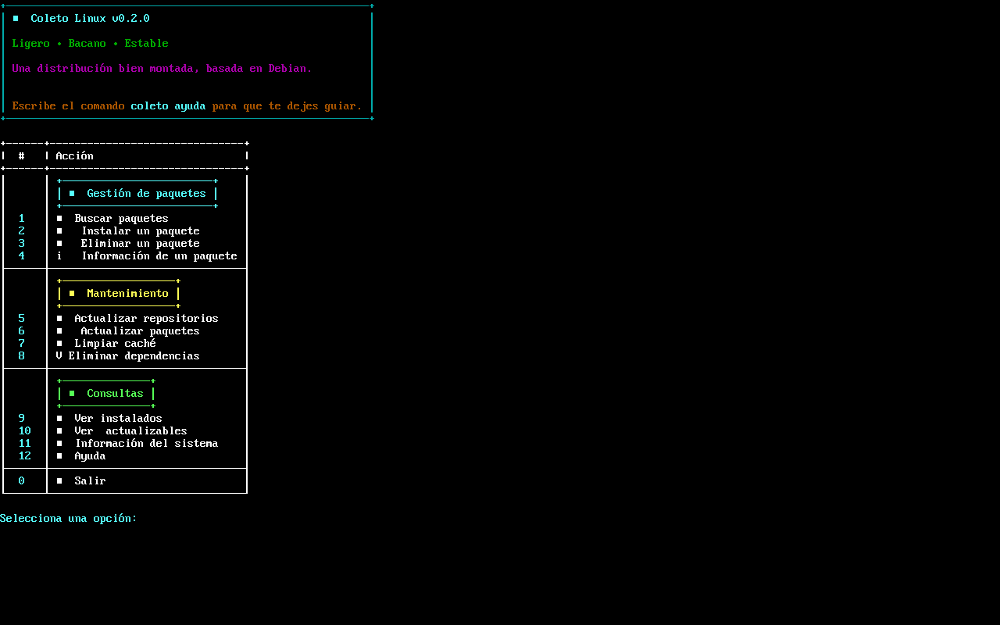
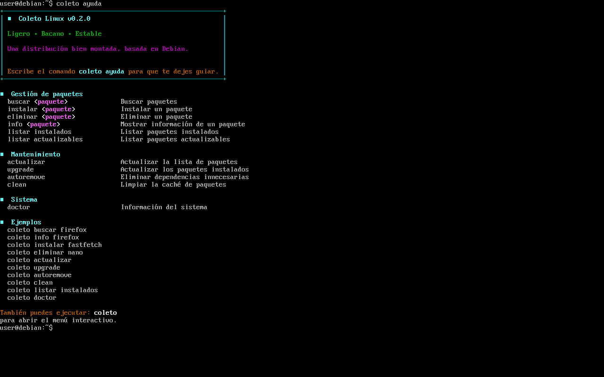
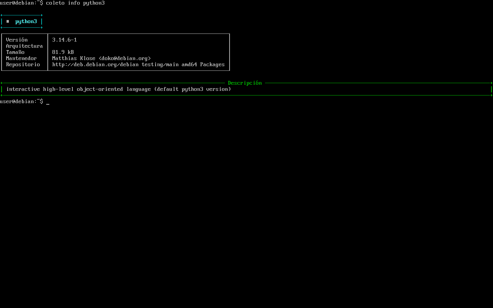
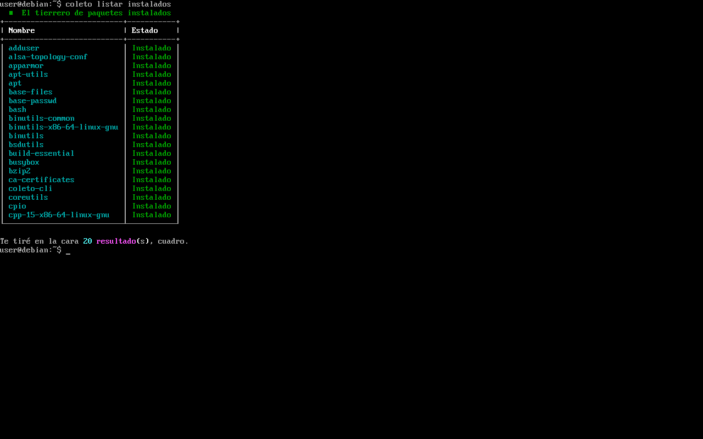

# 🐧 Coleto Linux


> **Ligero, bacano y estable.**

Coleto Linux es una distribución GNU/Linux basada en Debian que busca ofrecer una experiencia moderna, ligera y amigable, manteniendo la estabilidad del ecosistema Debian mientras desarrolla una identidad propia.

Actualmente el proyecto se encuentra en desarrollo y está compuesto por varios componentes independientes que, en conjunto, darán vida a la distribución.

---

## 🚧 Estado del proyecto

**Versión actual:** `v0.2.0`

### Completado

- ✅ Arquitectura inicial del proyecto.
- ✅ Desarrollo de Coleto CLI v0.2.0.
- ✅ Organización del repositorio.
- ✅ Base para la futura distribución.

### En desarrollo

- 🚧 Construcción de la ISO con live-build.
- 🚧 Tema visual propio.
- 🚧 Iconos.
- 🚧 Instalador.
- 🚧 Personalización del sistema.

---

## 🎯 Objetivos

- Mantener la estabilidad de Debian.
- Mejorar la experiencia del usuario.
- Tener una identidad propia.
- Ser ligero.
- Ser fácil de usar.

---

# 📦 Componentes

## ✅ Coleto CLI

Herramienta de línea de comandos desarrollada en Python para facilitar la administración del sistema.

Actualmente incluye:

- 🔎 Buscar paquetes.
- 📥 Instalar paquetes.
- 🗑️ Eliminar paquetes.
- ℹ️ Consultar información de paquetes.
- 🔄 Actualizar repositorios.
- ⬆️ Actualizar paquetes.
- 🧹 Eliminar dependencias innecesarias.
- 🧼 Limpiar la caché de paquetes.
- 📋 Listar paquetes instalados.
- 📦 Listar paquetes actualizables.
- 💻 Información del sistema (`doctor`).
- 🎨 Menú interactivo.

---

## 🚧 Coleto Theme

Tema visual oficial de Coleto Linux.

---

## 🚧 Coleto Icons

Paquete de iconos oficial de Coleto Linux.

---

## 🚧 Coleto Wallpapers

Fondos de pantalla oficiales.

---

## 🚧 Live Build

Configuración para generar la imagen ISO oficial de Coleto Linux basada en Debian.

---

## 🚧 Coleto Installer

Instalador gráfico para la distribución.

---

# 🛣️ Roadmap

## ✅ v0.2.0

### Coleto CLI

- Gestión de paquetes mediante APT.
- Menú interactivo.
- Navegación mediante opciones numéricas.
- Integración con Rich.
- Arquitectura modular (`commands`, `services`, `models` y `ui`).

### Comandos disponibles

- `buscar`
- `instalar`
- `eliminar`
- `info`
- `actualizar`
- `upgrade`
- `autoremove`
- `limpiar`
- `listar instalados`
- `listar actualizables`
- `doctor`
- `ayuda`

---

## 🚧 Próximo objetivo (v0.3.0)

- Construcción de la primera ISO de prueba.
- Integración de live-build.
- Inclusión de Coleto CLI dentro de la ISO.
- Inicio de la personalización de la distribución.

---

## 📁 Estructura del proyecto

```text
coleto-linux/
├── coleto-cli/
├── coleto-theme/
├── coleto-icons/
├── live-build/
├── docs/
├── scripts/
└── assets/
```

---

## 🤝 Contribuciones

Coleto Linux es un proyecto en desarrollo.

Las ideas, sugerencias y reportes de errores son bienvenidos.

---

## 📷 Capturas de pantalla

| Menú Interactivo | Ayuda del CLI |
| :---: | :---: |
|  |  |

| Información de Paquetes | Listado de Paquetes |
| :---: | :---: |
|  |  |

---

## 📄 Licencia

Este proyecto está bajo la Licencia **GNU General Public License v3.0 (GPL-3.0)**. Consulta el archivo [LICENSE](LICENSE) para más detalles.
